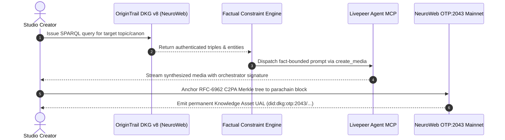

# Chronicle DKG: Verifiable Knowledge-Grounded Media Studio

[](https://www.chronicledkg.lol/)
[](#)
[](#)
[](#)

> **Live Deployment**: [Chronicle DKG | Verifiable Knowledge-Grounded Media Studio](https://www.chronicledkg.lol/)  
> **Hackathon Submission**: Track 1 — Livepeer Agent + OriginTrail DKG Track ($1,000)  
> An autonomous on-chain media synthesis engine bridging **OriginTrail DKG v8** and **Livepeer Decentralized AI Compute** to eliminate model hallucination and publish tamper-proof C2PA provenance receipts to the **NeuroWeb OTP:2043 Parachain**.

---

## The Knowledge Grounding Problem in Generative AI

Current text-to-video models operate in a probabilistic vacuum: when asked to depict a historical event, scientific mission, or canonical lore, they routinely hallucinate critical details—fabricating incorrect equipment, false timestamps, and inaccurate spatial geographies. Furthermore, once an AI video is rendered, there is zero cryptographic chain of custody linking the media to verified truth or the GPU node that created it.

**Chronicle DKG solves both challenges by creating a closed cryptographic loop between decentralized knowledge graphs and decentralized AI compute.**

---

## Verifiable Media Architecture

Chronicle connects the **OriginTrail Decentralized Knowledge Graph (DKG v8)** directly into the **Livepeer Agent Creative MCP** via an automated 6-step verification sequence:



---

## Core Technical Layers

### 1. Inbound Grounding via OriginTrail DKG v8 (SPARQL)
Before any diffusion job is dispatched, Chronicle queries the Decentralized Knowledge Graph to retrieve verified subject-predicate-object triples:
```sparql
PREFIX dkg: <https://schema.origintrail.io/dkg/v8/>
PREFIX xsd: <http://www.w3.org/2001/XMLSchema#>

SELECT ?entity ?label ?timestamp ?telemetry WHERE {
  ?entity a dkg:HistoricalEvent ;
          dkg:hasName "Apollo 11 Lunar Landing" ;
          dkg:eventTimestamp ?timestamp ;
          dkg:telemetryRecord ?telemetry .
} LIMIT 5
```
The Factual Constraint Engine extracts the resulting assertions (exact coordinates, technical designations, lighting conditions) and injects them as non-negotiable semantic boundaries into the prompt vector.

### 2. Fact-Constrained Livepeer GPU Inference
Structured generation tasks are routed directly to the **Livepeer Agent Creative MCP** (`https://agent.livepeer.org/api/mcp/creative`) over JSON-RPC 2.0:
- **Tool Invocations**: Leverages `create_media` for diffusion tasks across decentralized orchestrators, with `me` verification for participant quota tracking.
- **Node Tracking**: Captures the exact executing orchestrator node address, model checkpoint (e.g. `flux-schnell`), generation latency, and compute cost.

### 3. Outbound Provenance & NeuroWeb Parachain Anchoring
Once media is rendered, Chronicle constructs an **RFC-6962 C2PA cryptographic manifest** calculating SHA-256 Merkle roots over:
- The verified source triples from DKG v8
- The exact diffusion prompt and seed parameters
- The Livepeer orchestrator node signature and timestamp

The manifest is submitted via Substrate RPC directly to the **NeuroWeb OTP:2043 Parachain** (`https://astrosat-parachain-rpc.origin-trail.network/`), minting a permanent, decentralized **Uniform Asset Locator (UAL)** inspectable on Subscan.

---

## Verifiable Knowledge Asset Receipt Sample

Every shot synthesized through Chronicle generates a permanent on-chain provenance receipt:

```json
{
  "ual": "did:dkg:otp:2043/0x1c9e428a17682fbc7890def123456789abcdef01/48291",
  "parachain": "NeuroWeb (OTP:2043)",
  "blockNumber": 4829104,
  "extrinsicHash": "0x7f9a2b8c4d1e3f6a8b0c2d4e6f8a0b2c4d6e8f0a2b4c6d8e0f2a4b6c8d0e2f4a",
  "c2paManifest": {
    "claimGenerator": "Chronicle DKG v1.0.0",
    "merkleRootSha256": "3a8b4c9e1d2f0a5b7c8d9e0f1a2b3c4d5e6f7a8b9c0d1e2f3a4b5c6d7e8f9a0b",
    "orchestratorNode": "agent.livepeer.org/api/mcp/creative (flux-schnell)",
    "groundedAssertion": "Apollo 11 Lunar Module Eagle touched down at 20:17:40 UTC on July 20, 1969.",
    "sparqlSource": "SELECT ?entity ?coord WHERE { ?entity dkg:coordinates ?coord } LIMIT 1"
  },
  "subscanUrl": "https://neuroweb.subscan.io/extrinsic/4829104"
}
```

---

## Studio Workstation Capabilities

- **Interactive Knowledge Topology Graph**: Dynamic SVG canvas visualizing subject nodes, predicate relations, and verified object properties with real-time traversal.
- **Verification Inspector Modal**: Deep cryptographic drawer allowing creators to inspect Merkle roots, Subscan extrinsic hashes, and orchestrator signatures.
- **Cinematic Letterbox Canvas**: Custom 60 FPS playback stage featuring hardware-accelerated film LUTs (Kodak 2383, Fuji Eterna, Tri-X 35mm B&W) and live telemetry overlays.
- **Custom Fact Injector**: Enables directors to mint custom knowledge assertions and incorporate them into the shot ledger.

---

## Quickstart & Local Setup

### Live Production Deployment
Test the live studio directly in your browser:  
**[https://www.chronicledkg.lol](https://www.chronicledkg.lol)**

---

### Local Installation

### Prerequisites
- Node.js >= 18.x
- npm >= 9.x

### 1. Clone the Repository
```bash
git clone https://github.com/Redd1xx/chronicle-dkg.git
cd chronicle-dkg
```

### 2. Install Dependencies
```bash
npm install
```

### 3. Configure Environment (Optional)
```bash
cp .env.example .env.local
```
*(Leave empty to connect keyless using your hackathon participant allowance, or enter your Livepeer Agent Bearer key)*

### 4. Launch Development Studio
```bash
npm run dev
```
Open [http://localhost:3002](http://localhost:3002) to access the Chronicle DKG workstation.

---

## Technology Stack

- **Frontend & App Framework**: Next.js 14 (App Router), React 18, TypeScript
- **Knowledge Graph Layer**: OriginTrail DKG v8 JSON-LD & SPARQL schemas
- **Blockchain Layer**: NeuroWeb OTP:2043 Substrate Parachain RPC
- **AI Inference Engine**: Livepeer Agent Creative MCP (`https://agent.livepeer.org/api/mcp/creative`)
- **Styling & Icons**: Tailwind CSS, Lucide Icons
- **Audio Feedback**: Procedural Web Audio API sound cues

---

## Author & Track Information

- **Author**: redd
- **GitHub**: [@Redd1xx](https://github.com/Redd1xx)
- **Email**: omeyimi15@gmail.com
- **Track**: Track 1 — Livepeer Agent + OriginTrail DKG Track ($1,000)
- **License**: MIT
