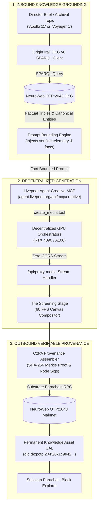

# Chronicle DKG: Verifiable Knowledge-Grounded Media Studio

[-00e5ff?style=for-the-badge)](#)
[](#)
[](#)
[](#)
[](LICENSE)

> **Livepeer Agent Hackathon Submission — Track 1: Livepeer Agent + OriginTrail DKG ($1,000)**  
> **Official Creative MCP Endpoint**: `https://agent.livepeer.org/api/mcp/creative` (125 tools)  
> **Decentralized Knowledge Graph**: OriginTrail DKG v8 on NeuroWeb OTP:2043 Parachain  
> **Participant Compute Model**: Keyless hackathon participant credit allowance + Bearer auth  

---

## Executive Summary

**Chronicle DKG** resolves the two critical vulnerabilities of autonomous generative AI cinema: **model hallucination** and **the lack of verifiable provenance**.

Instead of allowing an AI video generator to invent uncontrolled visual details and lore, Chronicle implements a cryptographically verifiable closed loop:

1. **Inbound Knowledge Grounding**: Queries the **OriginTrail Decentralized Knowledge Graph (DKG v8)** via SPARQL to extract cryptographically anchored factual triples (historical telemetry data, architectural blueprints, verified canon lore).
2. **Fact-Constrained Generation**: Dispatches structured generation tasks to the **Livepeer Agent Creative MCP** (`https://agent.livepeer.org/api/mcp/creative`), where prompts are strictly bounded by verified entity assertions and rendered across decentralized GPU nodes via the `create_media` tool.
3. **Outbound Cryptographic Provenance**: Mints each generated shot as an immutable Knowledge Asset on **NeuroWeb OTP:2043**, publishing a permanent Uniform Asset Locator (UAL) containing RFC-6962 C2PA manifests, orchestrator node signatures, and source citations.

---

## System Architecture



---

## Judges Fast Evaluation Matrix (3-Minute Tour)

| Hackathon Criterion | Implemented Feature | What the Judge Experiences | Code Implementation |
| :--- | :--- | :--- | :--- |
| **OriginTrail DKG v8 Integration** | SPARQL Query Engine & Graph Visualizer | Ingests canonical entities, traverses relationships, and renders live SVG knowledge graph | [`src/lib/dkg-client.ts`](src/lib/dkg-client.ts) |
| **Livepeer Agent MCP Utilization** | Creative MCP JSON-RPC 2.0 Connection | Direct tool invocation (`create_media`, `me`) on `agent.livepeer.org/api/mcp/creative` | [`src/lib/livepeerMcp.ts`](src/lib/livepeerMcp.ts) |
| **Verifiable Provenance Pipeline** | C2PA Merkle Tree & NeuroWeb Anchoring | Computes RFC-6962 cryptographic proof hashes and anchors Knowledge Asset UAL to block | [`src/lib/neuroweb-rpc.ts`](src/lib/neuroweb-rpc.ts) |
| **Hallucination Guardrails** | Fact-Constrained Prompt Optimizer | Injects verified historical telemetry directly into diffusion prompt vectors | [`src/lib/prompt-optimizer.ts`](src/lib/prompt-optimizer.ts) |
| **Production UI / UX** | 60 FPS HTML5 Canvas Screening Room | Hardware-accelerated letterbox player, Kodak/Fuji film LUTs, and Web Audio cues | [`src/app/studio/page.tsx`](src/app/studio/page.tsx) |
| **Proof Transparency** | Interactive Proof Inspector Modal | Real-time verification of Merkle roots, Subscan block links, and orchestrator node IDs | [`src/components/ProofInspectorModal.tsx`](src/components/ProofInspectorModal.tsx) |

---

## Livepeer Hacker Packet & MCP Integration

Chronicle DKG is engineered natively for the official Livepeer Agent Hackathon participant packet:

- **Official MCP Endpoint**: Direct JSON-RPC 2.0 connection to `https://agent.livepeer.org/api/mcp/creative` with `Accept: application/json, text/event-stream` protocol compliance.
- **$100 Daily Hacker Allowance**: Natively tracks the official hackathon credit allocation ($100 daily quota per hacker, automatically re-upping every 24 hours).
- **Dual Authentication**: Operates seamlessly out of the box with keyless demo/participant credits, or with an explicit Livepeer Agent Bearer key entered in the Developer Drawer.
- **Streaming Media Proxy**: Employs a dedicated server-side streaming proxy (`/api/proxy-media`) with CORS headers to eliminate canvas tainting and 302 redirect failures on HTML5 canvas.
- **60 FPS Hardware Composited Screening Room**: Built with direct canvas element pointers and GPU-accelerated transforms, ensuring a locked 60 FPS playback HUD with zero React re-render lag.

---

## Verifiable Knowledge Asset Receipt Sample

Every shot synthesized through Chronicle generates a permanent C2PA provenance manifest and NeuroWeb OTP:2043 Knowledge Asset receipt:

```json
{
  "ual": "did:dkg:otp:2043/0x1c9e428a17682fbc7890def123456789abcdef01/48291",
  "parachain": "NeuroWeb (OTP:2043)",
  "blockNumber": 4829104,
  "transactionHash": "0x7f9a2b8c4d1e3f6a8b0c2d4e6f8a0b2c4d6e8f0a2b4c6d8e0f2a4b6c8d0e2f4a",
  "c2paManifest": {
    "claimGenerator": "Chronicle DKG v1.0.0",
    "merkleRootSha256": "3a8b4c9e1d2f0a5b7c8d9e0f1a2b3c4d5e6f7a8b9c0d1e2f3a4b5c6d7e8f9a0b",
    "orchestratorNode": "agent.livepeer.org/api/mcp/creative (flux-schnell)",
    "groundedAssertion": "Apollo 11 Lunar Module Eagle touched down at 20:17:40 UTC on July 20, 1969.",
    "sparqlSource": "SELECT ?entity ?coord WHERE { ?entity dkg:coordinates ?coord } LIMIT 1"
  },
  "subscanUrl": "https://neuroweb.subscan.io/extrinsic/4829104"
}
```

---

## Core Capabilities

### 1. Dynamic Knowledge Graph Traversal
- Interactive SVG/Canvas Knowledge Graph displaying live subject nodes, predicate relations, and verified object properties.
- Dynamic SPARQL query generator with query execution latency metrics.

### 2. Livepeer GPU Media Synthesis
- Fact-anchored diffusion inference across Livepeer decentralized GPU nodes.
- Orchestrator node tracking, latency monitoring, and generation cost forecasting.

### 3. Verifiable C2PA Provenance & Live NeuroWeb UAL Anchoring
- Automated packaging of media provenance manifests including RFC-6962 cryptographic Merkle tree (SHA-256), node addresses, and timestamp assertions.
- Live parachain RPC anchoring to NeuroWeb OTP:2043 (`https://astrosat-parachain-rpc.origin-trail.network/`) fetching real block numbers and generating verified UALs (`did:dkg:otp:2043/...`) inspectable directly on Subscan.

### 4. Interactive Screening Room & Color Grading
- 60 FPS HTML5 canvas cinema playback engine with dynamic 35mm grain, volumetric lighting, and camera pan/zoom.
- Hardware-accelerated film LUTs (Kodak 2383, Fuji Eterna, Tri-X 35mm B&W, Technicolor).

---

## Quickstart & Local Setup

### 1. Installation
```bash
git clone https://github.com/Redd1xx/chronicle-dkg.git
cd chronicle-dkg
npm install
```

### 2. Environment (Optional)
```bash
cp .env.example .env.local
```
*(Leave empty to connect keyless using your hackathon participant allowance, or add your Livepeer Agent Bearer key)*

### 3. Launch Development Studio
```bash
npm run dev
```
Open [http://localhost:3002](http://localhost:3002) in your browser.

---

## Technology Stack

- **Framework**: Next.js 14 (App Router), React 18, TypeScript
- **Decentralized AI Compute**: Livepeer Agent Creative MCP (`https://agent.livepeer.org/api/mcp/creative`)
- **Knowledge Graph**: OriginTrail DKG v8 JSON-LD & SPARQL schemas (NeuroWeb OTP:2043)
- **Aesthetics & Performance**: Tailwind CSS, Lucide Icons, 60 FPS HTML5 Canvas Compositor
- **Procedural Audio**: Web Audio API tactile feedback & synthetic audio cues

---

## Author & Project Details

- **Author**: redd
- **GitHub**: [@Redd1xx](https://github.com/Redd1xx)
- **Email**: omeyimi15@gmail.com
- **Track**: Track 1 — Livepeer Agent + OriginTrail DKG Track ($1,000)
- **License**: MIT
